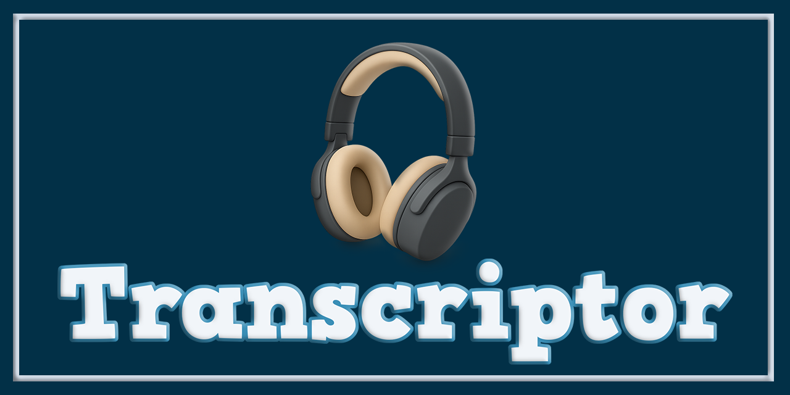

# 📝 Transcriptor

**Sistema de transcripción automática de audios con interfaz gráfica profesional**


---

## 📌 Descripción general

**Transcriptor** es una aplicación de escritorio desarrollada en **Python** que permite la **transcripción automática de audios en español**, integrando modelos avanzados de **OpenAI Whisper** y diarización de hablantes, con una **interfaz gráfica moderna, estable y orientada a uso institucional**.

El sistema está diseñado para entornos donde se requiere **precisión, trazabilidad y facilidad de uso**, como entrevistas informativas, declaraciones, informes psicológicos y documentación administrativa.

---



---

## 🎯 Características principales

✔ Interfaz gráfica profesional basada en **Tkinter**
✔ Transcripción automática mediante **Whisper (small, medium, large-v3)**
✔ Procesamiento en **segundo plano (multiprocessing)**
✔ Barra de progreso en tiempo real
✔ Registro detallado del proceso (log interno)
✔ Soporte para **plantillas DOCX personalizadas**
✔ Diseño visual institucional (colores, iconografía, efectos HiDPI)
✔ Bloqueo inteligente de controles durante la ejecución
✔ Ventanas de diálogo personalizadas (StyledDialog)
✔ Sistema portable (no requiere instalación tradicional)

---

## 🖥 Interfaz de usuario

La aplicación cuenta con:

* Selección de carpeta de audios
* Selección opcional de plantilla DOCX
* Selección del modelo Whisper
* Botones de acción con retroalimentación visual
* Barra de progreso dinámica
* Consola interna de eventos
* Ventana “Acerca de” integrada
* Control seguro de cierre durante procesos activos

La interfaz está optimizada para pantallas **HiDPI**, con renderizado mejorado de imágenes, sombras y relieve visual.

---

## 📷 Capturas de pantalla

<p align="center">
  
</p>

---

## ⚙️ Arquitectura del sistema

```
Transcripciones/
│
├─ gui/                # Interfaz gráfica
│   ├─ main_window.py
│   ├─ about_window.py
│
├─ core/               # Lógica de transcripción
├─ utils/              # Utilidades comunes
├─ exporters/          # Exportación de resultados
├─ images/             # Recursos gráficos (logo, iconos, botones)
├─ whisper_env/        # Entorno virtual aislado
├─ worker.py           # Proceso de transcripción (multiprocessing)
├─ ENTREVISTA INFORMATIVA.docx
└─ iniciar.vbs         # Lanzador sin consola
```

---

## 🔐 Seguridad y control de ejecución

El sistema incluye mecanismos para:

* Evitar ejecuciones simultáneas
* Bloquear botones durante la transcripción
* Confirmar cierre si hay procesos activos
* Validar existencia de archivos críticos
* Detectar movimientos indebidos de la carpeta base
* Mantener portabilidad sin uso del registro de Windows

---

## 🚀 Ejecución del sistema

El usuario final **no necesita interactuar con la consola**.

La aplicación se inicia mediante:

* Acceso directo creado automáticamente
* Script VBS que:

  * Activa el entorno virtual
  * Oculta la consola
  * Ejecuta la interfaz gráfica

---

## 📦 Requisitos técnicos

* Windows 10 / 11
* Python 3.10+
* GPU opcional (CUDA recomendado para modelos grandes)

Dependencias principales:

* `faster-whisper`
* `torch`
* `pyannote.audio`
* `Pillow`
* `tkinter`

> Todas las dependencias se encuentran contenidas dentro del entorno virtual `whisper_env`.

---

## 🧾 Formatos de salida

* **TXT** → Transcripción limpia y directa
* **DOCX** → Documento formateado usando plantilla institucional

---

## 🏛 Enfoque institucional

Este proyecto fue diseñado con criterios de:

* Usabilidad para personal no técnico
* Estabilidad operativa
* Presentación profesional
* Adaptabilidad a flujos de trabajo oficiales
* Minimización de errores humanos

---

## 📄 Licencia

```

### Licencia privada / institucional

Uso restringido a fines **internos o institucionales**.
La redistribución, modificación o comercialización requiere autorización expresa del autor.

---

## 👨‍💻 Autor

*   **Nombre:** Pablo Téllez
*   **Contacto:** pharmakoz@gmail.com

📍 **Tarija, Bolivia — 2026**


---

## ⭐ Estado del proyecto

✔ Estable
✔ En producción
✔ Orientado a uso profesional
---

⭐ Si este proyecto te resulta útil, considera dejar una estrella en el repositorio.