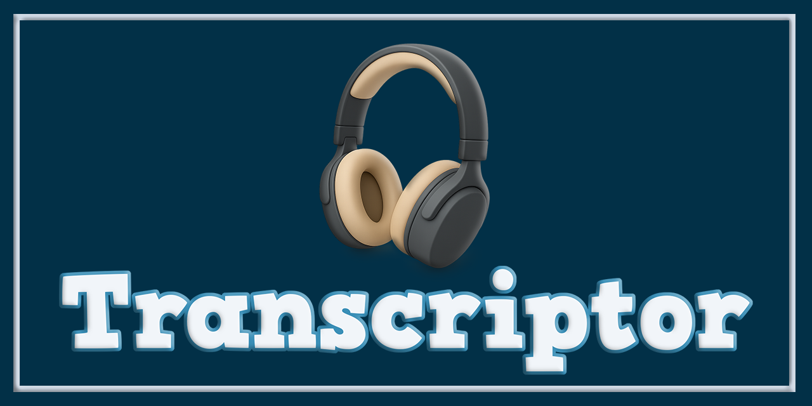

# 📝 Transcriptor V1.0 - Edición Élite

**Sistema de transcripción automática de audios blindado con aceleración por GPU**


---

## 💎 Novedades: Edición Élite
Esta versión representa la evolución profesional definitiva del sistema:
- **Blindaje de Lógica:** Toda la inteligencia del sistema ha sido convertida a binarios `.pyd`, protegiendo la propiedad intelectual y evitando manipulaciones.
- **Firma Digital Profesional:** El instalador y el ejecutable principal cuentan con la firma digital SHA256 verificada.
- **Identidad Visual Premium:** Nuevo icono multi-capa de alta resolución (16px a 256px) para una nitidez absoluta en Windows 10/11.
- **Portabilidad Dinámica:** El sistema detecta automáticamente su ubicación, permitiendo renombrar o mover la carpeta del programa sin pérdida de funcionalidad.
- **Silencio Operativo:** Implementación de la clase `SilentPopen` para eliminar cualquier parpadeo de consola durante el uso.

---

## 📌 Descripción general

**Transcriptor V1.0** es una aplicación de escritorio desarrollada en **Python** para la **transcripción de audios**. Utiliza el motor **WhisperX** con alineación fonética y un sistema de **Lógica Gramatical de Turnos**, optimizado para el contexto de entrevistas en **Bolivia**.

El sistema aprovecha la **GPU (NVIDIA CUDA)** para reducir los tiempos de procesamiento y genera documentos en formato Word con identificación de oradores.

---



---

## 🎯 Características principales

* Interfaz gráfica basada en **Tkinter** compatible con pantallas **HiDPI**.
* Motor **WhisperX** con alineación fonética (sincronía a nivel de palabra).
* **Aceleración por hardware**: Soporte nativo para **NVIDIA CUDA 12.1**.
* **Lógica Gramatical de Turnos**: Sistema de reasignación automática que identifica el patrón "Pregunta-Respuesta" para corregir errores de diarización.
* **Diccionario Nacional**: Integración de nombres de calles de Tarija y una base de datos de **934 nombres y apellidos** comunes en toda Bolivia.
* **Motor RunMatcher**: Edición quirúrgica de XML en Word sin romper estilos.
* **Soporte Multi-idioma**: Interfaz con detección automática para 9 idiomas.

---

## 🖥 Interfaz de usuario

La aplicación cuenta con:

* **Sistema Drag & Drop**: Carga instantánea de archivos o carpetas.
* **Selector de Género Profesional**: Define si el entrevistador es "Psicólogo" o "Psicóloga".
* Barra de progreso y consola de eventos en tiempo real.
* **Software Blindado**: Ejecutable único (`Transcriptor.exe`) sin consola visible.

---

## 📷 Capturas de pantalla

<p align="center">
  
</p>

--- 

## ⚙️ Arquitectura del sistema

```
Transcriptor/
│
├─ Transcriptor.exe    # Lanzador Blindado y Firmado (Punto de entrada)
├─ worker.pyd          # Proceso trabajador blindado
├─ core/               # Lógica blindada (.pyd)
├─ utils/              # Léxico y diccionarios blindados (.pyd)
├─ exporters/          # Motor DOCX blindado (.pyd)
├─ gui/                # Componentes de interfaz blindados (.pyd)
├─ assets/             # Imágenes y traducciones
├─ whisper_env/        # Entorno virtual optimizado
└─ models_cache/       # Modelos de IA (Se distribuye por separado)
```

---

## 📦 Instalación y Despliegue

1. **Descarga:** Diríjase a la sección de [Releases](https://github.com/Pablitus666/Transcriptor/releases) y descargue el archivo `Transcriptor.zip`.
2. **Descompresión:** Extraiga el contenido del `.zip` en una carpeta local (ej. Escritorio o C:\Transcriptor). **Es vital mantener todos los archivos y carpetas juntos para el correcto funcionamiento.**
3. **Ejecución:** Inicie el programa mediante `Transcriptor.exe`. Al ser un archivo firmado digitalmente por Walter Pablo Téllez Ayala, Windows lo reconocerá como software seguro.
4. **Modelos:** Copie su carpeta `models_cache` al directorio raíz del programa para habilitar el procesamiento 100% offline.

---

## 👨‍💻 Autor

**Walter Pablo Téllez Ayala**  
Software Developer

📍 Tarija, Bolivia  <br>
📧 [pharmakoz@gmail.com](mailto:pharmakoz@gmail.com) 

© 2026 — Transcriptor (Edición Élite)
